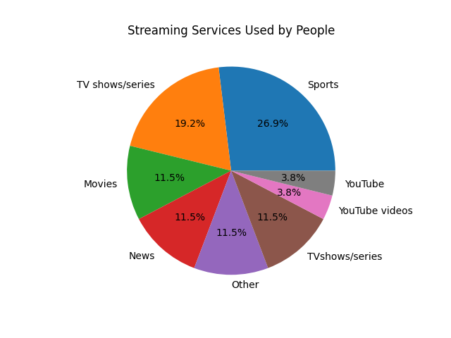

# Project 3 -  Student Submission

## Project Info
- **Project Title:** _Your project title here_
- **Your Name:**
- **Date:** 10/08/2025

---

## Survey Information
- **Survey Topic:** My survey is about streaming services and what devices, amount of hours, frequently of the streaming service they go on, satisfaction of the streaming service, and the amount of streaming sevices they go on.
- **Survey Link:** [Click here to view survey](https://docs.google.com/forms/d/1I42bcyZIuZbXKUykX20CxfEDr_9rBh6pLJVtu-BLHvQ/edit)
- **Number of Responses:** 11

---

## Survey Questions
List the questions you asked in your survey and their type:

| # | Question Text | Response Type (Multiple Choice / Numeric / Text) |
|---|---------------|-------------------------------------------------|
| 1 | Your name?| Text
| 2 | Which of the following devices do you use most often to stream content?| Multiple choice
| 3 | What type of content do you watch most frequently?| Multiple choice
| 4 | On average, how many hours per week do you spend streaming content? ___ hours (type one to two numbers)| Numeric
| 5 | On a scale from 1 to 10, how satisfied are you with your current streaming platform? (1 = not satisfied at all, 10 = very satisfied)| 
| 6 | How many different streaming platforms do you currently subscribe to? ___ platforms (type one to two numbers)| Numeric

---

## Data Overview
- **Link to Raw Data File (CSV):** [Download here](ef2.csv)
- **Number of Columns:** 5
- **Number of Rows:** 26
- **Any Cleaning Steps Taken:** I first removed numbers that could cause the .csv to not work with the analysis and anything that was not part of the argument. Another thing that I did was remove some of the fake data and added the real data from my survey. Anything that was not what I asked for or was wrong I changed the value to the correct thing that I wanted.

---

## Charts Created
List each chart you made, its type, and what it shows. Add a link or embed an image if possible.

| # | Chart Title | Chart Type (Bar, Histogram, Scatter, etc.) | Brief Description | Link or Image |
|---|-------------|-------------------------------------------|-------------------|---------------|
| 1 | _Devices Used by People_ | Bar Chart | Shows how many people are in each device to watch their streaming services. |  |
| 2 | _Streaming Services Used by People_ | Pie Chart | The pie chart shows the percentage of people in each streaming service. |  |
| 3 | _Average Time vs Satisfaction_ | Scatterplot | The scatterplot shows how each person falls in x, average hours, and y, satisfaction, and the relationship between average time and satisfaction. |  |
| 4 | _Satisfaction by Device_ | Boxplot | Shows the satisfaction in each device with the boxplot (representing satisfaction) showing the 25th, 50th, and 75th percentile, plus any outliers, based on the responses by the data and shows the relationship between satisfaction and devices. |  |
| 5 | _Average Time by Device_ | Boxplot | Shows the average time in each device with the boxplot (representing average time) showing the 25th, 50th, and 75th percentile, plus any outliers, based on the responses by the data and shows the relationship between devices and average time. |  |
| 6 | _Average Time Distribution_ | Pie chart | The pie chart shows the amount of people in each amount of average time, in percentage, and shows what average amount of hours is the least and the average amount of hours that's the most. |  |
| 7 | _Streaming Services Distribution_ | Histogram | Shows how many people are in each streaming services. |  |

---

## Data Analysis & Insights
Write a short analysis of your findings. Include at least one interesting insight from your data.

> _Example:_ “We found that students who sleep 7–8 hours per night reported higher average GPAs than those who sleep less than 5 hours. Energy drink consumption peaked among 11th graders.”

---

## Reflection
Answer briefly:
- What went well in your project?
- What was the most challenging part?
- If you had more time, what would you do differently?

---

### Submission Checklist
- [ ] Link to survey included
- [ ] Questions listed
- [ ] Raw data file attached or linked
- [ ] 3+ charts created and linked/embedded
- [ ] Data analysis section filled in